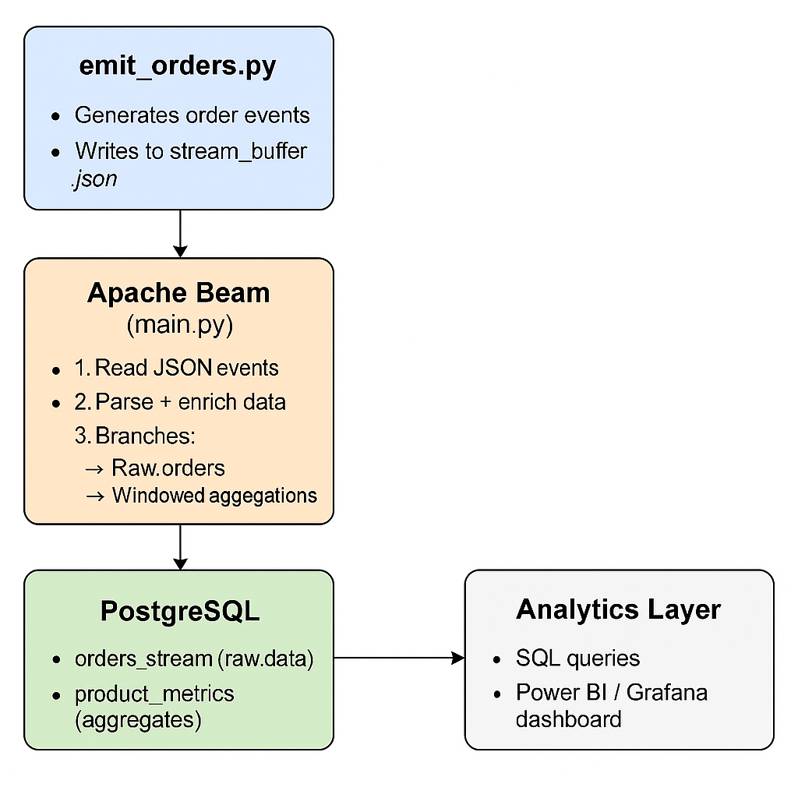

# Real-Time Order Analytics Pipeline — Apache Beam + PostgreSQL

A fully containerized real-time data pipeline that simulates continuous e-commerce order streams, processes them using Apache Beam, and stores both raw and aggregated data in PostgreSQL.

---

## Architecture Overview


---

## Tech Stack
Python · Apache Beam · PostgreSQL · Docker

---

## Pipeline Flow
1. **Emitter (`emit_orders.py`)**  
   Generates fake order events (product, price, quantity, timestamp) every second and appends them to `stream_buffer.json`.

2. **Processor (`main.py`)**  
   - Reads live JSON lines from the buffer file.  
   - Parses, enriches, and validates each record.  
   - Writes:
     - Raw orders to `orders_stream`
     - One-minute revenue and order count aggregates to `product_metrics`

3. **Database (`db_init.sql`)**  
   Initializes the tables automatically when PostgreSQL starts.

4. **Containerization**  
   `docker-compose.yml` orchestrates the Beam and PostgreSQL containers for a fully isolated and reproducible environment.

---

## Folder Structure
beam_pipeline/
├─ app/
│ ├─ main.py
│ ├─ emit_orders.py
│ └─ requirements.txt
├─ db_init.sql
├─ Dockerfile
├─ docker-compose.yml
├─ assets/
│ └─ architecture.png
└─ README.md


---

## Run Locally
```bash
# Build and start containers
docker compose up --build
```
# In another terminal, start the emitter
```python app/emit_orders.py

docker exec -it beam_postgres psql -U postgres -d beam_test
beam_test=# SELECT COUNT(*) FROM orders_stream;
beam_test=# SELECT * FROM product_metrics ORDER BY window_start DESC LIMIT 5;
```


## Business Value

This project demonstrates:

- Real-time ETL and windowed aggregation  
- Continuous ingestion and transformation of event data  
- Parallel writes to raw and aggregated tables  
- Containerized, reproducible deployment  

The same architecture pattern can be applied to real-world streaming analytics in domains such as retail, healthcare, or finance.

---

## Next Steps

- Add Grafana or Power BI visualization  
- Deploy Apache Beam on Google Dataflow or AWS Glue Streaming for scalability  

---

## Author

**Don Richardson Bayya**  
Data Engineer — focused on building scalable, real-time analytics systems.


